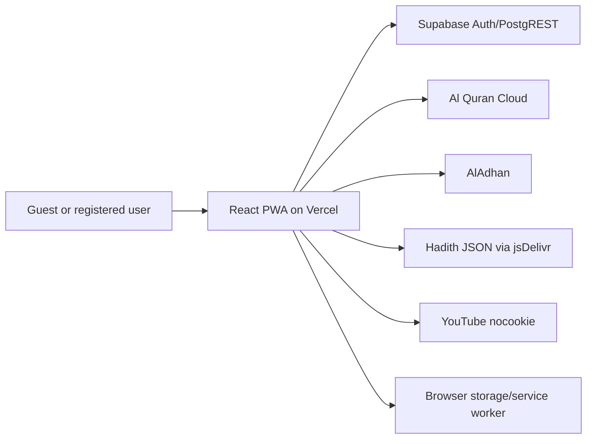

# Technical Requirements Document

**Product:** Sakinah - Islamic Companion | **Status:** As Built | **Version:** 1.0 | **Date:** 2026-09-07

> **STACK LOCKED: Future implementation must not substitute frameworks, database, ORM, authentication model or hosting architecture unless the owner approves the change and this TRD is updated first.**

## 1. System overview and architecture

Sakinah is a static single-page React PWA. Vercel serves Vite output; the browser communicates directly with Supabase and read-only Islamic content providers. No repository-owned Node/Express API runs in production.



Architecture style: client-side SPA/PWA with Backend-as-a-Service.

## 2. Repository structure

| Path | Purpose |
|---|---|
| `src/App.jsx` | Composition, navigation, core Quran/Hadith/prayer/Tasbeeh/profile views |
| `src/components/Upgrade.jsx` | Home, onboarding, share cards, Duas, Ibadat, More |
| `src/components/QuranExtras.jsx` | Seerah, recitation, subjects, Fahm lessons, line modes |
| `src/components/AuthModal.jsx` | Email/password/reset/Google auth UI |
| `src/lib/islamicApi.js` | External content API adapter and validation |
| `src/lib/supabase.js` | Supabase client/session configuration |
| `src/lib/security.js` | Security validation helpers |
| `src/*.css` | Component and design-system styling |
| `public/` | Manifest, service worker, offline page, icons, Dua JSON |
| `supabase/schema.sql` | Tables, trigger, and RLS policies |
| `tests/security.test.js` | Node-native security regression tests |
| `vercel.json` | SPA rewrite, CSP, security/cache headers |

## 3. Locked stack and versions

| Concern | Requirement |
|---|---|
| Runtime/build | Node.js compatible with Vite 5; exact production Node not repository-pinned |
| UI | React 18.3.1, React DOM 18.3.1 |
| Build | Vite 5.4.21; React plugin 4.7.0 installed |
| Icons | lucide-react 0.468.0 |
| CSS | Tailwind 3.4.19, PostCSS 8.5.27, Autoprefixer 10.5.4, custom CSS |
| Auth/data SDK | `@supabase/supabase-js` 2.57.0 |
| Package manager | npm; `package-lock.json` |
| Database | Supabase PostgreSQL; no ORM |
| Hosting | Vercel static deployment |

State management uses React hooks plus local/session storage. Routing is an allow-listed view map using the `view` query parameter; no React Router.

## 4. Authentication and roles

Supabase Auth uses email/password, password-reset email, and Google OAuth. Client settings enable PKCE, URL session detection, token refresh, and persistent storage key `sakinah-auth-session`. Guest and authenticated-user states exist; no admin role exists. Authorization is database-enforced with `auth.uid()` RLS.

## 5. Integrations

| Service | Purpose | Data sent |
|---|---|---|
| Supabase | Auth, profiles, bookmarks, Tasbeeh sessions | Credentials/tokens and owner data |
| Al Quran Cloud | Surah/Juz/edition text and audio metadata | Validated content identifiers |
| AlAdhan | Prayer times and Asma-ul-Husna | Coordinates/date for prayer requests |
| Hadith API via jsDelivr | Collection/section JSON | Validated collection paths |
| YouTube nocookie | Seerah playlist embeds | Standard embed/browser metadata |
| Unsplash | Flash/Hajj images and card composition | Image request metadata |
| Google Fonts | Amiri, DM Sans, Playfair Display | Font request metadata |
| WhatsApp | Support deep link | Only when user activates link |

## 6. Storage

- Local storage: UI preferences, guest bookmarks/history, custom Tasbeeh, notification settings/log, Supabase session.
- Session storage: browser install-gate dismissal.
- Cache Storage: versioned shell/code/images and Quran responses; prayer-coordinate requests are excluded.
- Supabase tables: `profiles`, `bookmarks`, `tasbeeh_sessions`.
- Dedicated file/object storage: not present.

## 7. Environment variables

| Name | Exposure | Purpose |
|---|---|---|
| `VITE_SUPABASE_URL` | Public browser bundle | Supabase project origin |
| `VITE_SUPABASE_PUBLISHABLE_KEY` | Public browser bundle | Supabase publishable/anon access |

Never use `VITE_` for service-role, database, OAuth client-secret, SMTP, webhook, or private keys. Missing/placeholder values leave account features unavailable while preserving guest mode.

## 8. Development, build, tests, deployment

```bash
npm install
npm run dev
npm run test:security
npm run build
npm run preview
npm audit --omit=dev
```

`dev` and `preview` bind to `127.0.0.1`. Build output is `dist/`. Vercel rewrites SPA requests to `index.html`; real files take precedence. No Docker configuration, migration runner, seed command, lint script, or type-check script exists.

## 9. API conventions

- External fetch adapters throw short generic errors.
- Numeric identifiers are bounded; dynamic path segments are allow-listed by syntax.
- UI loading/error/empty state is managed per component.
- Supabase queries use SDK filters and RLS; no raw SQL from the browser.
- No repository-owned JSON API response convention exists.

## 10. Logging and error handling

The root error boundary prevents a blank screen. Auth logs contain only operation mode/redacted codes; identifiers and raw provider errors are excluded. Provider-facing user messages are short and recoverable. No centralized telemetry or correlation IDs exist.

## 11. Security controls

- Vercel CSP, HSTS, anti-framing, MIME, referrer, permissions, opener/resource headers.
- React escaped rendering; no dangerous HTML sink found.
- OAuth destination restricted to configured HTTPS Supabase origin.
- Auth and content inputs bounded.
- Custom image allow-list and 1.5 MB limit.
- Supabase RLS ownership.
- Production dependency audit clean.
- See `docs/security/SECURITY-AUDIT.md` for findings and owner actions.

## 12. Performance/scalability

Lazy-loaded Quran extras reduce initial work. Long provider corpora are fetched on demand; some lists are locally paginated. Static Vercel assets scale at CDN level. Direct third-party calls avoid a server bottleneck but inherit provider rate/availability limits. Supabase payload growth and JSON bookmark size require future quotas/index review.

## 13. Naming and conventions

- React components: PascalCase functions.
- Hooks/helpers: camelCase.
- CSS: feature-oriented kebab-case selectors.
- View identifiers: lower-case strings in the central map.
- Supabase tables/columns: snake_case.
- Security changes require regression tests under `tests/`.

## 14. Hard constraints / DO NOT USE or change

- Do not replace React/Vite, Supabase, PostgreSQL, Vercel, or the SDK auth model without owner approval.
- Do not add a second router/state framework casually.
- Do not put secrets in `VITE_*` or source.
- Do not bypass RLS or use a service-role key in the browser.
- Do not cache coordinate-bearing prayer URLs.
- Do not weaken CSP to broad `*` sources.
- Do not alter the three existing table semantics without migration/data review.
- Do not claim reliable background push/Azan without a server push architecture and platform tests.

## 15. Technical debt and unresolved risk

- Vite/esbuild development advisories need an owner-approved Node/Vite major upgrade.
- No browser E2E, lint, type-check, or accessibility automation.
- Supabase remote configuration is not infrastructure-as-code.
- Book completeness/licensing and some translations are not verified.
- Very large provider data may need virtualization.
- Feedback is local-only; account deletion/export is absent.
- Service-worker data expiration is version-based rather than TTL-based.