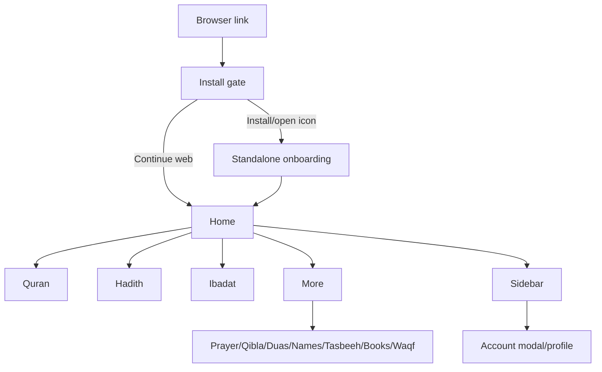
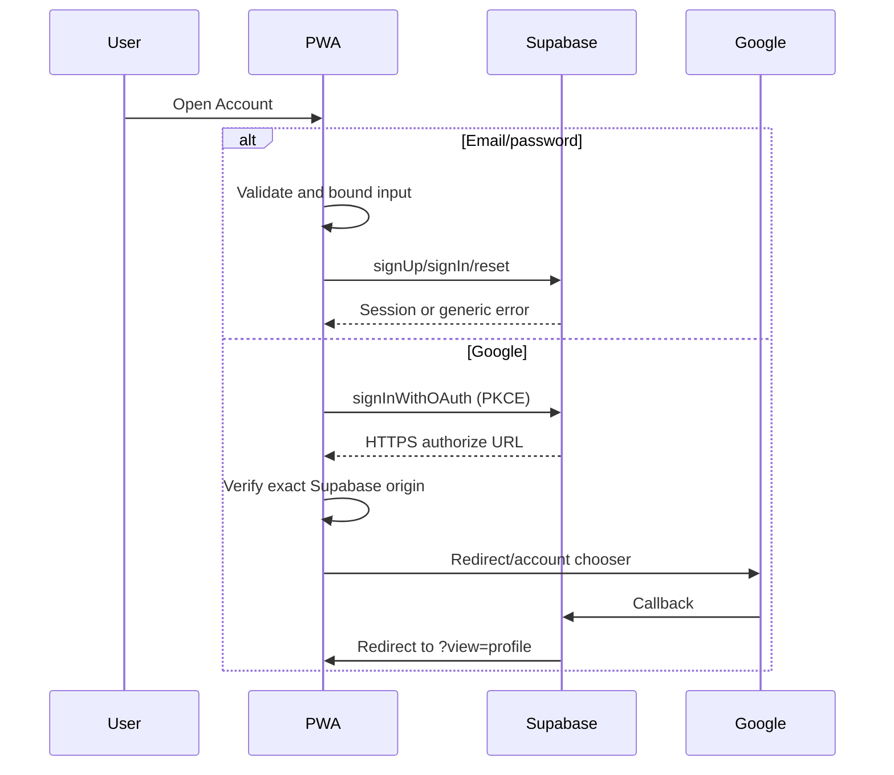

# App/Web Flow Document

**Product:** Sakinah | **Status:** As Built | **Version:** 1.0 | **Date:** 2026-09-07

## 1. Roles and global navigation

Guests and authenticated users share the same content screens. Account-bound save operations require authentication. No administrator/privileged screen exists. Global navigation consists of the sticky header/hamburger, persistent prayer widget, bottom bar (Home, Quran, Hadith, Ibadat, More), and back-to-Home behavior on secondary views.

## 2. Screen inventory

| Screen / view | Purpose | Access | Main data | Key actions | Next destinations |
|---|---|---|---|---|---|
| Install gate | PWA installation guidance | Public browser | Platform/install event | Install, iOS instructions, continue web | Standalone app or Home |
| Onboarding | Feature introduction | First standalone launch | Static slides | Next, All Done | Home |
| Home (`home`) | Daily overview | All | Prayer state, rotating Ayat, Flashes | Search handoff, share, quick access | Quran, Duas, Tasbeeh, Ibadat, Flashes |
| Quran (`quran`) | Quran hub | All | Remote Quran and local progress | Choose mode/reader, favorite, bookmark, recite | Reader, favorites, lessons, subjects |
| Al-Quran reader | Surah/Juz reading | All | Arabic/English/Urdu/audio | Search, select, translate, customize, save | Quran hub |
| Seerat-un-Nabi | Video series | All | Static season/episode metadata | Select season/episode, play | Quran hub |
| 15/16-Line | Page-oriented reading modes | All | Quran page API | Previous/next page | Quran hub |
| Recitation | Audio selection | All | Surah API/audio | Select and play | Quran hub |
| Subjects | Topical Quran index | All | Static 36-topic map | Search, open Ayah reference | Al-Quran |
| Fahm-ul-Quran | 38 lessons | All | Lesson refs + Quran API | Expand, recite, open Ayah | Al-Quran |
| Hadith (`hadith`) | Collection selection | All | Eight remote collections | Select book | Topic list |
| Hadith topic list | Chapters within collection | All | Remote section metadata | Language preference, choose topic | Hadith list |
| Hadith list | Narrations | All; saving requires account for cloud | Remote editions | Share, favorite | Topic list |
| Ibadat (`ibadat`) | Worship guides | All | Static bilingual guidance | Select Salah/Sawm/Hajj/Umrah/Janaza | Detail cards |
| More (`more`) | Secondary feature launcher | All | Static menu | Open feature | Feature view |
| Prayer (`prayer`) | Daily prayer schedule | All | Geolocation + AlAdhan | Refresh location, toggle prayers, request notifications | Home |
| Qibla (`qibla`) | Direction finder | All | Coordinates/sensor | Enable compass | Home |
| Tasbeeh (`tasbeeh`) | Dhikr counter | All | Local/cloud records | Count, undo, reset, create/edit | Home/Profile |
| Books (`library`) | Islamic book catalog | All | Repository metadata/content | Search/filter/open | Reader entry |
| Calendar (`calendar`) | Gregorian/Hijri context | All | Device date/static events | Month navigation | Home |
| Flashes (`flashes`) | Shareable cards | All | Static images/text | Share rendered image | Home |
| Duas (`duas`) | Supplication browser | All | Local JSON/fallback | Search/browse | Home |
| Shahadat (`shahadat`) | Declaration and meaning | All | Static content | Read | Home |
| 99 Names (`names`) | Asma-ul-Husna | All | AlAdhan/local cache | Browse | Home |
| Waqf (`waqf`) | Stop-sign guide | All | Static guide | Browse | Home |
| Profile (`profile`) | Account and saved summary | Auth-aware | Supabase user/local stats | Sign in/out | Auth/Home |
| Sidebar | Account/settings/support/FAQ | All | Preferences/log | Toggle, open account/support | Profile/features |
| Auth modal | Login/signup/reset/OAuth | Public | User input/Supabase | Submit, Google, switch mode | Profile/current view |
| Offline fallback | Network recovery | Public/offline | Cached shell | Retry | Home |

## 3. Authentication flows

- Login: validated email/password → Supabase → session closes modal.
- Registration: validated name/email/password → Supabase; session or confirmation instruction depending external Auth setting.
- Reset: enumeration-resistant message regardless of account existence.
- Logout: `supabase.auth.signOut()`; UI returns to guest state.
- Expired session: Supabase auto-refreshes when possible; otherwise auth-state listener returns guest state.
- Access denied: RLS rejects non-owner data; UI-specific error quality varies by operation.

## 4. Core workflows

### Quran

Mode → choose Juz/Surah/edition or extra section → loading → content → optional translation/audio → local save; authenticated save additionally writes through Supabase. Subject/lesson references set a target and return to Al-Quran.

### Hadith

Collection → provider collection metadata → real section/topic → remote section data → language display where present → share/favorite. A missing edition yields the available language or an error state.

### Prayer/Qibla

Screen/app load → permission request → coordinates → validated request/current date → AlAdhan times → countdown and reminder settings. Qibla derives bearing locally and combines it with device orientation when permission/sensor exists.

### Tasbeeh

Select preset/custom → tap/undo → save and reset → local rolling history; authenticated sessions also insert a user-owned cloud row. Custom flow validates title, meaning, target, and image before local/cloud persistence.

## 5. Data states by screen type

| Screen type | Loading | Empty | Error | Populated |
|---|---|---|---|---|
| Quran/Hadith | Loading note/skeleton where implemented | Empty component/list | Provider-specific message | Reader/list/cards |
| Prayer/Qibla | Location required / countdown placeholder | No coordinates | Permission/service message | Times/bearing |
| Profile/history | Auth/session readiness | Synced history placeholder | Some queries log rather than show error | User/stats |
| Duas/Names | Loading message | Empty list | Reconnect note | Searchable cards/grid |
| Flashes | Animated skeleton | Not expected | Gradient fallback | Decoded background/card content |
| Books/Ibadat/static | Immediate | Not expected | Limited error surface | Static cards |

## 6. Search/filter/import/export

- Home search routes to Quran but does not preserve/query the term: partial implementation.
- Quran and Subjects search filter local/remote-loaded metadata.
- Books, Duas, and Hadith expose module-specific filtering where coded.
- Share uses Web Share and file sharing when supported; fallback downloads/copies.
- No bulk export/import exists.
- Custom image selection is the only file import; no server file endpoint exists.

## 7. Error, recovery, and destructive paths

- Root render failures show a retry screen through `AppErrorBoundary`.
- Offline navigation falls back to `public/offline.html`.
- Provider failures show local messages; cached Quran/app resources may remain usable.
- Permission denial retains the app and explains that location/notification is required.
- Unknown `view` values fall back to Home; no dedicated 404 screen.
- Bookmark removal and sign-out are immediate; no confirmation dialog.
- No account deletion or destructive database administration flow exists.

## 8. Responsive/mobile rules

The app is capped at 560 px and centered on larger displays. Bottom navigation is fixed with safe-area padding. The sidebar slides from the right. Browser-only view presents the install gate; standalone mode gates first-run onboarding. iOS uses manual Add to Home Screen instructions because `beforeinstallprompt` is unavailable.

## 9. Missing or unverified flows

- Admin workflows: not implemented.
- Account deletion/data export: not implemented.
- Server-scheduled push: not implemented.
- Reliable auto-Azan in suspended state: not verified.
- Complete offline Quran/Hadith/books: not verified.
- Cross-user RLS behavior must be owner-tested against the remote project.